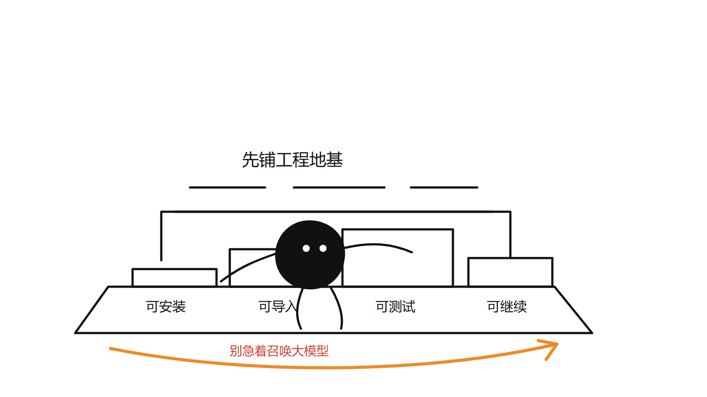
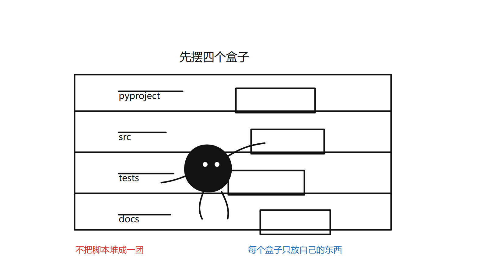
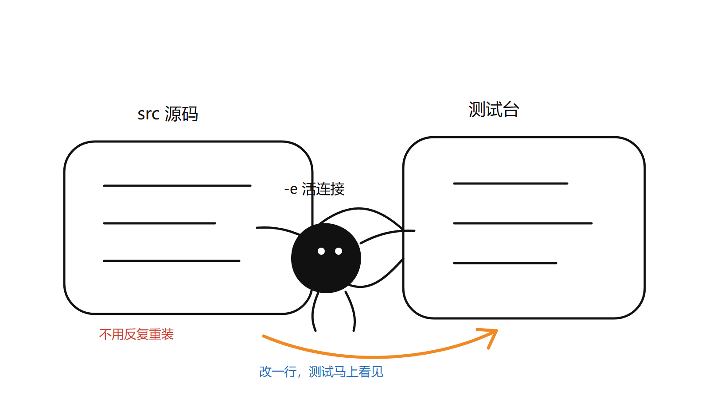
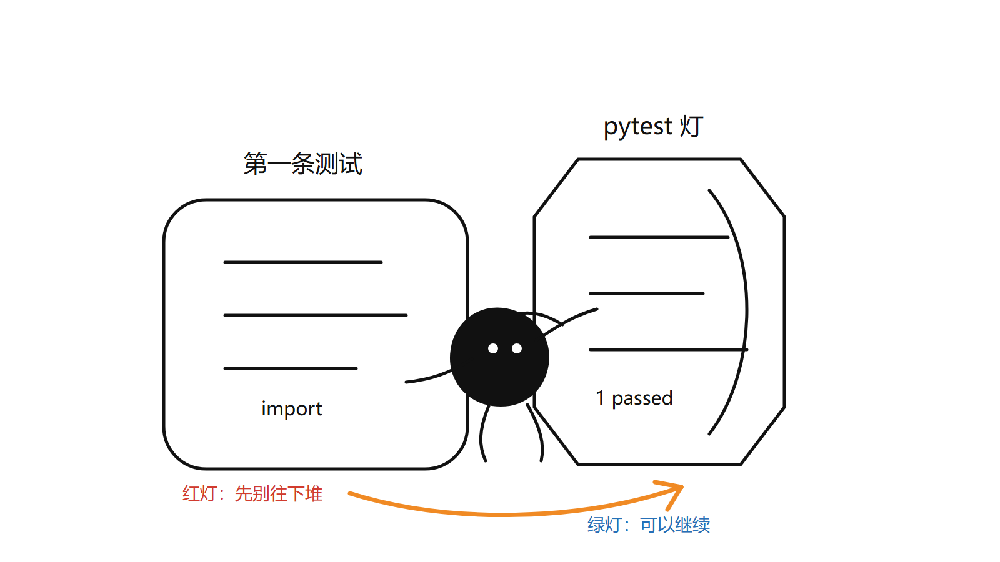

# 第 01 章：工程启动与开发环境

## 1. 本章学习目标

学完本章后，你应该能做到：

- 知道这个项目要实现什么。
- 知道企业级 Agent 工程为什么要先搭项目基线。
- 能安装开发依赖。
- 能运行单元测试。
- 能读懂当前最小代码结构。
- 能根据测试结果判断项目是否处于可继续开发状态。

本章不会调用真实大模型，也不会实现 Agent 推理逻辑。第一步只做一件事：让工程可以被安装、被导入、被测试。



## 2. 你正在做的项目是什么

本项目叫 `enterprise-agent`，目标是一步步实现一个企业级 AI Agent 工程。

它最终会包含：

- 统一 LLM 网关：集中管理模型调用。
- Agent 核心循环：让 Agent 能思考、调用工具、观察结果。
- 企业工具系统：让工具有统一的安全、超时、限流和错误处理。
- LangGraph 编排：支持复杂流程、分支、重试和人工审批。
- RAG 系统：让 Agent 能检索企业知识库。
- 记忆系统：让 Agent 能管理短期和长期上下文。
- API 与生产化能力：服务接口、监控、评估、安全和部署。

这些内容会分章节实现。本章只建立工程地基。

## 3. 为什么第一章不直接写 Agent

很多初学项目会直接从“调用一次大模型”开始。但企业级工程不能这样开始。

原因有三个：

1. 没有测试，后面每次修改都不知道有没有破坏旧功能。
2. 没有标准包结构，代码很快会散落成脚本。
3. 没有稳定的开发命令，学员之间的环境问题会越来越多。

所以第一章先建立最小工程基线：

- `pyproject.toml`：告诉 Python 这个项目如何安装、如何测试。
- `src/enterprise_agent/`：正式源码包。
- `tests/`：测试目录。
- `ProjectInfo`：一个很小的对象，用来验证包能否正常导入。

## 4. 当前目录结构

本章完成后，关键目录如下：

```text
enterprise-agent/
├── pyproject.toml
├── src/
│   └── enterprise_agent/
│       ├── __init__.py
│       └── project.py
├── tests/
│   └── unit/
│       └── test_project_setup.py
└── docs/
    ├── COURSE_PROGRESS.md
    ├── ENGINEERING_PROGRESS.md
    └── lessons/
        └── 01-project-setup.md
```

先记住一个规则：后续正式代码都放在 `src/enterprise_agent/` 下面。



## 5. 安装开发环境

进入项目目录：

```powershell
cd E:\onecom\agents\enterprise-agent
```

建议创建虚拟环境：

```powershell
python -m venv .venv
```

激活虚拟环境：

```powershell
.\.venv\Scripts\Activate.ps1
```

安装项目和开发依赖：

```powershell
python -m pip install -e ".[dev]"
```

这里的 `-e` 表示 editable install。它的意思是：你修改 `src/` 下的代码后，不需要重新安装包，测试会直接读取最新代码。



## 6. 运行测试

在 `enterprise-agent` 目录下运行：

```powershell
python -m pytest
```

如果测试通过，说明三件事是正常的：

- Python 能找到 `enterprise_agent` 包。
- `pyproject.toml` 的测试配置生效。
- 当前最小工程结构没有问题。



## 7. 第一段代码：ProjectInfo

打开：

```text
src/enterprise_agent/project.py
```

你会看到：

```python
from dataclasses import dataclass


@dataclass(frozen=True)
class ProjectInfo:
    name: str
    version: str
    stage: str
```

这里用了 `dataclass`。它适合表达简单数据对象。

`frozen=True` 的意思是对象创建后不能被修改。对项目元信息来说，这是合理的，因为它不应该在运行中被随便改掉。

## 8. 第一条测试

打开：

```text
tests/unit/test_project_setup.py
```

测试内容是：

```python
from enterprise_agent import get_project_info


def test_project_info_exposes_first_chapter_stage():
    info = get_project_info()

    assert info.name == "enterprise-agent"
    assert info.version == "0.1.0"
    assert info.stage == "chapter-01-project-setup"
```

这条测试很小，但它有明确价值：

- 验证包能导入。
- 验证函数能调用。
- 验证返回值是预期结果。

后续每一章都要保持这个习惯：实现一个能力，就写一个能验证它的测试。

## 9. 常见问题

### 9.1 找不到 pytest

如果出现 `No module named pytest`，通常是还没有安装开发依赖。

重新执行：

```powershell
python -m pip install -e ".[dev]"
```

### 9.2 找不到 enterprise_agent

如果出现 `No module named enterprise_agent`，检查两件事：

- 当前目录是否是 `E:\onecom\agents\enterprise-agent`。
- 是否通过 `python -m pytest` 运行测试。

本项目已经在 `pyproject.toml` 中配置了：

```toml
pythonpath = ["src"]
```

这会让 pytest 从 `src/` 下查找源码包。

### 9.3 为什么只保留 src/enterprise_agent

本课程从第一章开始统一使用正式包目录：

```text
src/enterprise_agent/
```

旧的 `src/agents/` 草稿目录已经清理。这样学员只需要记住一个源码入口，后续新增 LLM、Agent、工具、RAG 和记忆模块都会放在 `src/enterprise_agent/` 下。

## 10. 本章练习

请完成以下练习：

1. 修改 `ProjectInfo.stage` 的返回值，然后运行测试，观察失败信息。
2. 把返回值改回 `chapter-01-project-setup`，再次运行测试，确认通过。
3. 在 `ProjectInfo` 中新增字段 `description`。
4. 更新 `get_project_info()`，给 `description` 一个简短说明。
5. 更新测试，断言 `description` 不为空。

练习的目的不是增加功能，而是让你熟悉“改代码 → 跑测试 → 根据结果修正”的基本节奏。

## 11. 本章验收标准

完成本章后，你需要能独立完成：

- 进入项目目录。
- 安装开发依赖。
- 运行 `python -m pytest`。
- 解释 `pyproject.toml` 的作用。
- 解释 `src/enterprise_agent/` 的作用。
- 解释为什么第一章只写一个很小的测试。

## 12. 下一章预告

第 02 章会讲 Python 包结构与导入路径。

你会学习：

- 为什么源码放在 `src/enterprise_agent/` 下。
- `__init__.py` 有什么作用。
- 什么时候从包入口导出函数或类。
- 测试里为什么可以直接 `from enterprise_agent import get_project_info`。
- 后续新增 `llm`、`agents`、`tools` 模块时，应该如何组织导入关系。

统一 LLM 网关会在第 06 章开始实现。这样你会先掌握 Python 工程结构，再进入模型调用。
