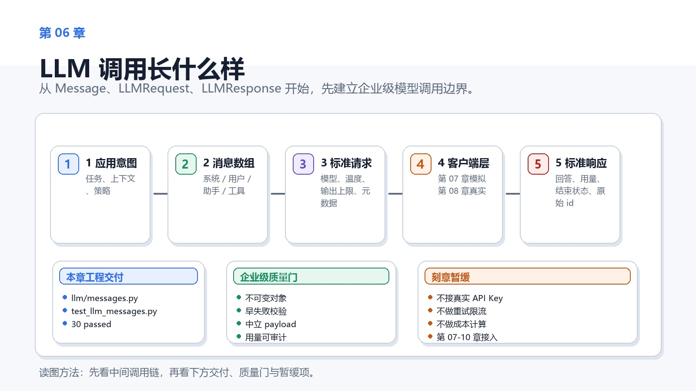
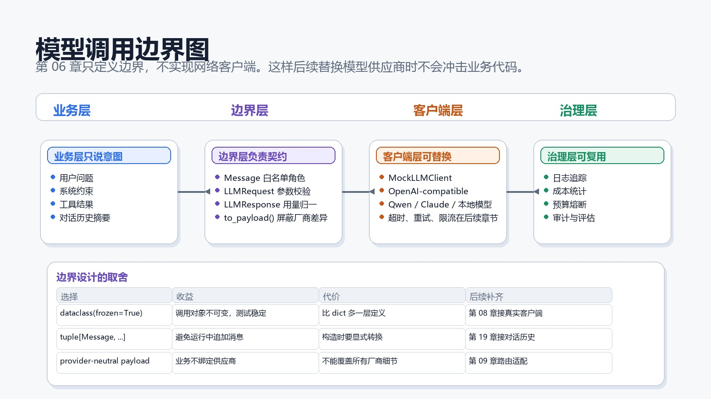
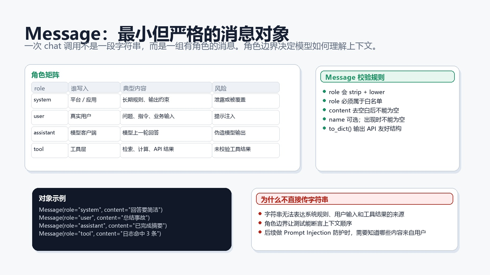
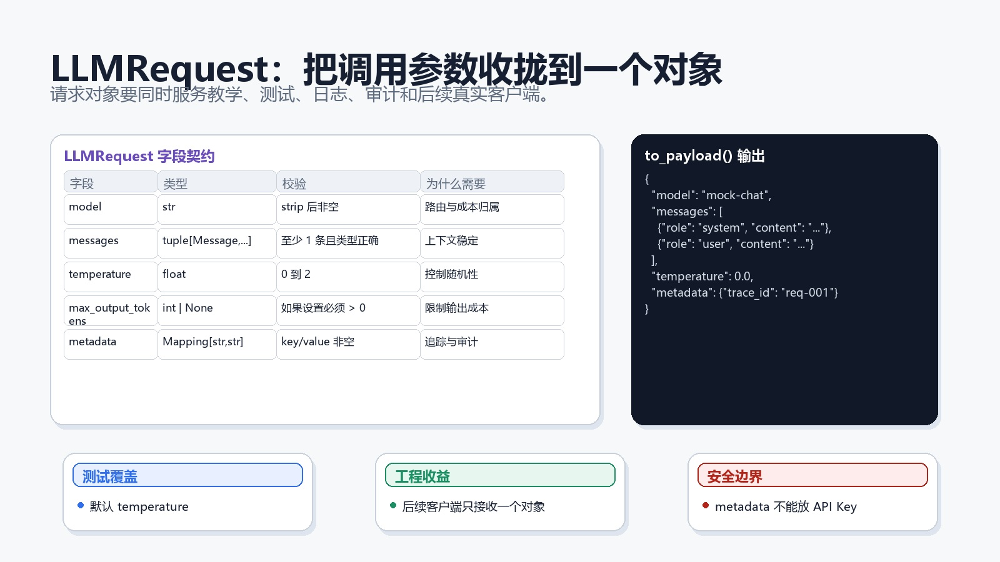
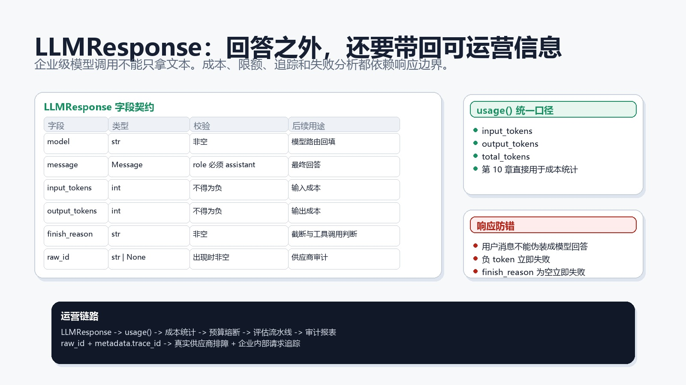

# 第 06 章：LLM 调用长什么样



## 1. 本章交付物

本章进入阶段 B：LLM 调用与 Prompt 基础。

本章会新增一个 LLM 边界子包：

```text
src/enterprise_agent/llm/
```

它提供三个公开对象：

```python
Message
LLMRequest
LLMResponse
```

本章结束时，项目应该能做到：

- 用 `Message` 表达一次 chat 调用里的角色和内容。
- 用 `LLMRequest` 表达一次模型请求的完整边界。
- 用 `LLMResponse` 表达模型返回结果和 token 用量。
- 把请求转换成 provider-neutral payload。
- 用单元测试覆盖消息角色、空内容、请求参数、响应 token 和错误输入。

本章仍然不调用真实模型，不需要 API Key，也不做网络请求。

## 1.1 完成态

完成本章时，你应该能画出这条边界：

```text
业务意图 -> Message[] -> LLMRequest -> LLMClient -> LLMResponse -> 治理能力
```

如果你只能说“LLM 调用就是传一个 prompt”，但说不清角色、请求对象、响应对象和 token 用量在哪里，本章还没有完成。

## 2. 为什么不直接传字符串

很多入门示例会这样调用模型：

```python
prompt = "请总结这段文本"
```

这适合演示，不适合企业工程。

企业级 Agent 里，一次模型调用通常包含：

- 系统规则。
- 用户输入。
- 对话历史。
- 工具返回结果。
- 输出格式约束。
- trace id、租户、任务类型等元数据。
- token 用量和成本统计。

如果所有内容都挤在一个字符串里，后续会很难做安全审计、成本控制、上下文裁剪、模型路由和错误排查。

第 06 章先把“模型调用长什么样”讲清楚。只有边界清楚，第 07 章的 Mock 客户端、第 08 章的真实模型客户端、第 09 章的多模型路由才有稳定落点。

## 3. 模型调用边界



本章把模型调用拆成四层：

| 层 | 职责 | 本章是否实现 |
|----|------|--------------|
| 业务层 | 表达用户问题、系统约束、工具结果和上下文 | 只用示例解释 |
| 边界层 | 定义 `Message`、`LLMRequest`、`LLMResponse` | 实现 |
| 客户端层 | Mock 客户端、真实模型客户端、超时、重试、限流 | 后续章节 |
| 治理层 | 日志、成本、预算、审计、评估 | 后续章节 |

这样拆的好处是：业务代码不直接依赖某个模型供应商的原始 JSON。

后续从 Mock 切换到 OpenAI-compatible、Qwen、Claude 或本地模型时，只要客户端继续返回 `LLMResponse`，上层 Agent 就不需要重写。

## 4. 本章文件结构

本章新增后，关键结构是：

```text
enterprise-agent/
├── src/
│   └── enterprise_agent/
│       └── llm/
│           ├── __init__.py
│           └── messages.py
└── tests/
    └── unit/
        └── test_llm_messages.py
```

`llm` 是独立子包，不放在 `foundation` 里。

原因是 `foundation` 已经完成工程基础、配置、日志和错误消息。LLM 是新的业务能力边界，后续会继续长出客户端、路由、prompt 模板、成本统计和结构化输出。

## 5. 关键术语

| 术语 | 在本章里的意思 |
|------|----------------|
| `Message` | 一条带角色的聊天消息 |
| `role` | 消息来源，例如 `system`、`user`、`assistant`、`tool` |
| `LLMRequest` | 一次模型调用的标准请求对象 |
| `LLMResponse` | 一次模型调用的标准响应对象 |
| provider-neutral | 不绑定某个供应商的通用结构 |
| token usage | 输入 token、输出 token 和总 token 用量 |

## 6. Message



`Message` 的代码位置是：

```text
src/enterprise_agent/llm/messages.py
```

核心定义是：

```python
@dataclass(frozen=True)
class Message:
    role: str
    content: str
    name: str | None = None
```

它很小，但边界很重要。

`role` 只能是：

```python
ALLOWED_MESSAGE_ROLES = ("system", "user", "assistant", "tool")
```

这四类角色分别表达不同来源：

| role | 来源 | 常见内容 |
|------|------|----------|
| `system` | 应用或平台 | 长期规则、输出约束、安全要求 |
| `user` | 用户 | 问题、指令、业务输入 |
| `assistant` | 模型 | 模型上一轮回答或最终回答 |
| `tool` | 工具层 | 检索、计算、API 调用结果 |

角色不是装饰字段。它决定模型如何理解上下文，也决定后续安全模块如何判断哪些内容来自用户。

## 7. Message 校验规则

`Message.__post_init__()` 做三类清理和校验：

```python
clean_role = self.role.strip().lower()
clean_content = self.content.strip()
clean_name = self.name.strip() if self.name is not None else None
```

规则如下：

- `role` 会去掉空格并转成小写。
- `role` 必须属于白名单。
- `content` 去掉空格后不能为空。
- `name` 是可选字段，但如果出现，不能为空。

这里继续沿用第 05 章的错误消息风格：

```python
raise ValueError(format_error_message("content", "must not be empty"))
```

这样做的好处是错误消息短、具体、可测试。

## 8. to_dict

`Message` 提供：

```python
def to_dict(self) -> dict[str, str]:
```

它把对象转换成 API 友好的字典：

```python
Message(role="user", content="解释重试机制", name="student").to_dict()
```

返回：

```python
{
    "role": "user",
    "content": "解释重试机制",
    "name": "student",
}
```

注意这里仍然不是某个供应商的最终请求。它只是一个中立的消息 payload。真实客户端可以在第 08 章再根据供应商规则做适配。

## 9. LLMRequest



`LLMRequest` 表达一次模型调用的完整输入：

```python
@dataclass(frozen=True)
class LLMRequest:
    model: str
    messages: tuple[Message, ...]
    temperature: float = DEFAULT_TEMPERATURE
    max_output_tokens: int | None = None
    metadata: Mapping[str, str] = field(default_factory=dict)
```

这不是随便包一层对象。每个字段都有工程含义。

| 字段 | 作用 |
|------|------|
| `model` | 本次调用希望使用的模型名 |
| `messages` | 本次调用的上下文消息 |
| `temperature` | 控制输出随机性 |
| `max_output_tokens` | 控制最大输出长度 |
| `metadata` | 保存 trace id、任务类型、课程章节等审计信息 |

## 10. LLMRequest 校验规则

`LLMRequest` 做以下校验：

- `model` 去掉空格后不能为空。
- `messages` 至少包含一条消息。
- `messages` 里的每个元素都必须是 `Message`。
- `temperature` 必须在 `0` 到 `2` 之间。
- `max_output_tokens` 如果设置，必须大于 `0`。
- `metadata` 的 key 和 value 去掉空格后都不能为空。

这些规则看起来基础，但它们会挡住很多后续问题。

例如，空消息列表如果不在请求创建阶段拒绝，真实客户端可能会返回难懂的供应商错误。企业工程应该尽早失败，而且错误要落在自己能控制的位置。

## 11. 为什么 messages 用 tuple

`LLMRequest.messages` 最终会被转换成 tuple：

```python
messages = tuple(self.messages)
```

原因是请求对象创建后不应该被某个函数继续追加消息。

如果请求对象在运行中被修改，就很难解释：

- 日志记录的请求和真实发送的请求是否一致。
- 测试断言的消息顺序是否稳定。
- 成本统计对应的是哪一次上下文。

`dataclass(frozen=True)` 加上 tuple，是一个简单但有效的边界。

## 12. metadata 的边界

`metadata` 用来放审计和追踪字段，例如：

```python
metadata={"trace_id": "req-001", "lesson": "06"}
```

它不应该放：

- API Key。
- 用户密码。
- 长文本 prompt。
- 机密业务数据。

本章只校验 key 和 value 非空。更复杂的数据分级会放到安全章节处理。

现在先建立一个原则：`metadata` 是治理字段，不是秘密存储。

## 13. to_payload

`LLMRequest` 提供：

```python
def to_payload(self) -> dict[str, object]:
```

它返回一个 provider-neutral payload：

```python
{
    "model": "mock-chat",
    "messages": [
        {"role": "system", "content": "You are concise."},
        {"role": "user", "content": "Summarize the incident."},
    ],
    "temperature": 0.0,
    "metadata": {"trace_id": "req-001"},
}
```

这个 payload 的价值在于：

- 测试可以直接断言请求结构。
- 日志可以安全记录一部分字段。
- 后续客户端可以复用同一个入口。
- 多模型路由可以基于同一请求对象做决策。

## 14. prompt_text

`LLMRequest` 还有一个辅助属性：

```python
@property
def prompt_text(self) -> str:
```

它把所有消息内容用换行连接：

```text
You are concise.
Summarize the incident.
```

这不是要把请求退化成字符串。它只是服务简单测试、日志摘要或调试输出。

真正发送给模型时，仍然应该保留 message role。

## 15. LLMResponse



`LLMResponse` 表达一次模型调用的标准返回：

```python
@dataclass(frozen=True)
class LLMResponse:
    model: str
    message: Message
    input_tokens: int = 0
    output_tokens: int = 0
    finish_reason: str = "stop"
    raw_id: str | None = None
```

企业级模型调用不能只拿一段文本。

至少还需要知道：

- 哪个模型返回了结果。
- 输入用了多少 token。
- 输出用了多少 token。
- 模型为什么结束。
- 供应商原始响应 id 是什么。

这些字段会在后续接入成本统计、预算熔断、监控追踪和评估流水线。

## 16. LLMResponse 校验规则

`LLMResponse` 做以下校验：

- `model` 不能为空。
- `message.role` 必须是 `assistant`。
- `input_tokens` 不能是负数。
- `output_tokens` 不能是负数。
- `finish_reason` 不能为空。
- `raw_id` 如果出现，不能为空。

其中最容易忽略的是：

```python
if self.message.role != "assistant":
    raise ValueError(format_error_message("message.role", "must be assistant"))
```

响应对象必须代表模型回答，不能把用户消息误塞进去。

这条规则以后会保护 Agent 执行轨迹：用户说了什么、模型回答了什么、工具返回了什么，不能混在一起。

## 17. usage

`LLMResponse` 提供：

```python
def usage(self) -> dict[str, int]:
```

返回：

```python
{
    "input_tokens": 10,
    "output_tokens": 4,
    "total_tokens": 14,
}
```

`total_tokens` 也可以直接通过属性读取：

```python
response.total_tokens
```

本章只是统计数字。第 10 章会继续把 token 用量转成成本、预算和限制规则。

## 18. 测试解读

测试文件是：

```text
tests/unit/test_llm_messages.py
```

它覆盖七个场景：

- `Message` 会规范化 role、content 和 name。
- `Message` 会拒绝未知 role 和空 content。
- `LLMRequest` 会拒绝空 model 和空 messages。
- `LLMRequest` 会规范化 messages、metadata 和 `prompt_text`。
- `LLMRequest` 会拒绝非法 temperature 和输出上限。
- `LLMResponse` 会要求 assistant 消息并统计 token。
- `LLMResponse` 会拒绝 user 消息和负 token。

这些测试共同保护一个目标：模型调用的数据边界要在进入真实网络前就可验证。

## 19. 企业级取舍

本章有几个刻意选择。

### 19.1 用 dataclass，不直接用 dict

`dict` 很灵活，但灵活也意味着很容易漏字段、拼错字段或传错类型。

`dataclass(frozen=True)` 让字段清楚、对象不可变、错误更早暴露。

代价是多写了一些定义和校验代码。这个代价值得，因为后续所有客户端都会依赖这些边界。

### 19.2 暂时不用 Pydantic

真实项目里，Pydantic 很适合做复杂 schema 校验。

本章暂时不用，是为了让你先看清楚每条校验规则本身：

- 哪些字段不能为空。
- 哪些类型需要被规范化。
- 哪些值有范围限制。
- 错误应该在哪里抛出。

等第 12 章进入结构化输出与 JSON 校验时，再引入 Pydantic 会更自然。

### 19.3 不接真实 API

本章不接真实 API，是为了避免把两个问题混在一起：

- 数据边界是否清楚。
- 网络调用是否成功。

先把边界测清楚，再接 Mock 客户端，最后接真实模型。这是企业工程里更稳的推进顺序。

## 20. 常见问题

### 20.1 为什么 role 里没有 developer

不同模型供应商支持的角色不完全一致。

本课程先使用最常见的四类角色：`system`、`user`、`assistant`、`tool`。如果后续真实供应商需要 `developer` 或其他角色，可以在客户端适配层或路由层讨论。

本章不提前扩展，是为了保持学习边界稳定。

### 20.2 为什么 temperature 允许到 2

许多 chat API 使用 `0` 到 `2` 作为 temperature 的常见范围。

本章只做通用边界。不同供应商的更细限制会放在真实客户端章节处理。

### 20.3 为什么 raw_id 只是可选字段

Mock 客户端可能没有真实供应商 id。

真实客户端通常会有 response id 或 request id。保留 `raw_id` 字段，是为了后续审计和排障，但不强迫 Mock 阶段伪造供应商 id。

## 21. 读者自测

不看正文，尝试回答下面 6 个问题：

1. 为什么一次 LLM 调用不应该只用一个字符串表示？
2. `system`、`user`、`assistant`、`tool` 四类 role 各自表达什么来源？
3. `LLMRequest.messages` 为什么最终转成 tuple？
4. `metadata` 应该放什么，不应该放什么？
5. `LLMResponse.message.role` 为什么必须是 `assistant`？
6. `usage()` 后续会服务哪些企业级能力？

答不上来的地方，回到 `messages.py` 和测试文件对照阅读。

## 22. 练习

1. 新增一个测试：`Message(role=" USER ", content=" hello ")` 应规范化为 `role == "user"`。
2. 新增一个测试：`LLMRequest(..., metadata={" ": "x"})` 应抛出 `metadata keys must not be empty`。
3. 新增一个测试：`LLMResponse(..., output_tokens=-1)` 应被拒绝。
4. 给 `LLMRequest.to_payload()` 增加 `max_output_tokens` 的断言。
5. 思考：如果未来要支持流式输出，`LLMResponse` 应该新增字段，还是新增一个单独对象？

练习目标不是扩展很多功能，而是熟悉“先定义边界，再用测试保护边界”的节奏。

## 23. 验收标准

完成本章后，你应该能独立解释：

- `Message` 为什么需要 role。
- `LLMRequest` 每个字段的用途。
- `LLMResponse` 为什么要包含 token 用量。
- 为什么本章不接真实 API。
- 哪些校验属于边界层，哪些能力应该留给后续客户端层。

验收命令：

```powershell
python -m pytest
```

第 06 章完成时应看到：

```text
30 passed
```

## 24. 学习反馈

完成本章后，记录 3 句话：

1. 哪个对象的边界你已经能完整解释？
2. 哪条校验规则最容易被低估？
3. 如果第 07 章实现 Mock 客户端，你希望它最先模拟什么行为？

这些反馈会影响第 07 章 Mock LLM 客户端的讲解方式。

## 25. 下一章

第 07 章会实现 `MockLLMClient`。

你会学习如何定义 `BaseLLMClient`，如何让 Mock 客户端返回稳定响应，如何在不使用 API Key 的情况下测试一次完整模型调用。
