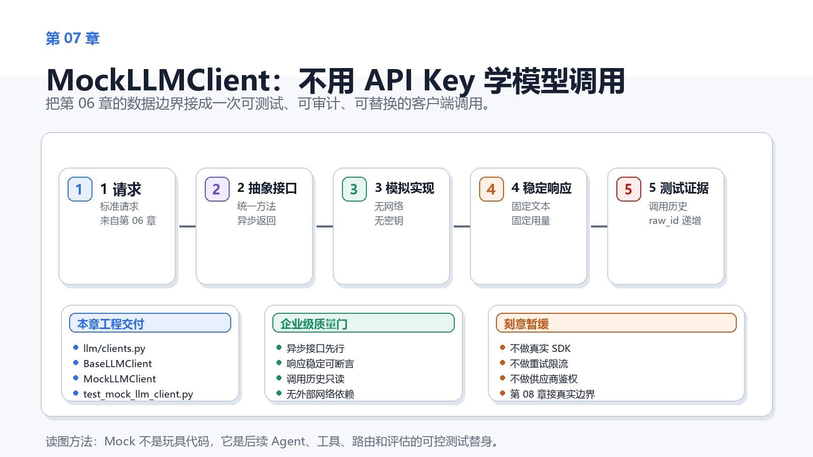
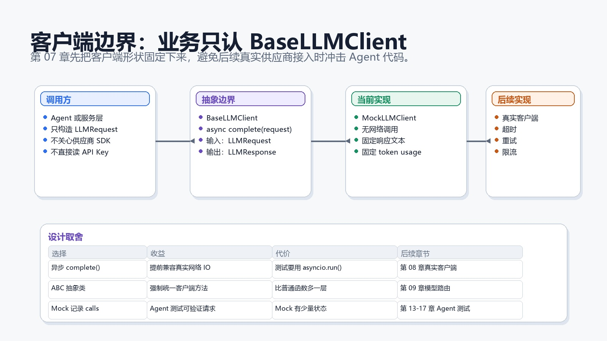
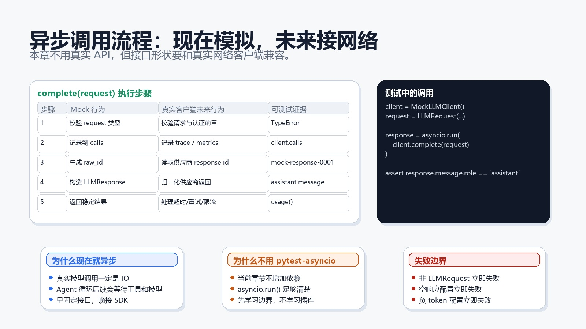
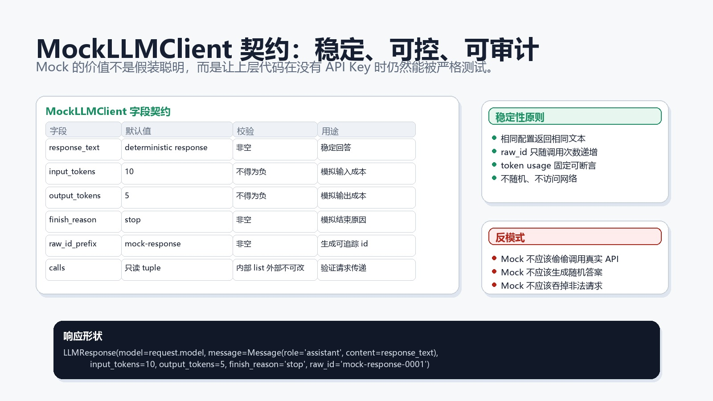
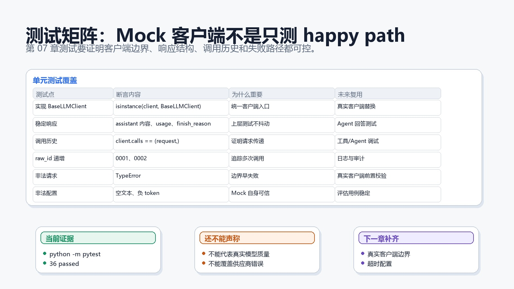

# 第 07 章：MockLLMClient：不用 API Key 学模型调用



## 1. 本章交付物

本章接上第 06 章的数据边界。

第 06 章定义了：

```python
Message
LLMRequest
LLMResponse
```

第 07 章会新增客户端边界：

```python
BaseLLMClient
MockLLMClient
```

本章结束时，项目应该能做到：

- 用统一接口表达“客户端收到请求并返回响应”。
- 不使用 API Key，也能完成一次可测试的模型调用。
- Mock 客户端返回稳定的 `LLMResponse`。
- Mock 客户端记录调用历史，方便测试上层 Agent。
- 用单元测试覆盖成功调用、调用历史、raw id、非法请求和非法配置。

本章仍然不接真实模型供应商，不引入 SDK，不访问网络。

## 1.1 完成态

完成本章时，你应该能解释这条链路：

```text
LLMRequest -> BaseLLMClient.complete() -> MockLLMClient -> LLMResponse
```

如果只能说“Mock 就是返回假数据”，但说不清为什么要有抽象接口、为什么要异步、为什么要记录调用历史，本章还没有完成。

## 2. 为什么需要 Mock LLM 客户端

真实模型调用有很多外部变量：

- API Key 是否存在。
- 网络是否稳定。
- 供应商服务是否可用。
- 模型输出是否随机。
- token 计费是否变化。
- 请求是否触发限流。

如果一开始就接真实模型，学习者会同时面对太多问题。测试也会变得不稳定。

Mock 客户端的目标不是模拟模型智能，而是稳定模拟“模型客户端边界”。

它让后续章节可以先测试：

- Agent 是否构造了正确请求。
- 工具结果是否进入消息上下文。
- 路由层是否选了正确模型。
- 成本统计是否读取了 token usage。
- 评估流水线是否能处理响应对象。

这些能力不应该依赖真实 API 才能测试。

## 3. 客户端边界



本章新增两个对象：

| 对象 | 职责 |
|------|------|
| `BaseLLMClient` | 所有 LLM 客户端必须遵守的抽象边界 |
| `MockLLMClient` | 无网络、无密钥、可预测的测试客户端 |

上层代码只应该依赖：

```python
BaseLLMClient
```

而不是依赖某个真实供应商 SDK。

这样做的收益是：第 08 章接真实客户端时，只要实现同一个 `complete()` 方法，上层代码就不需要因为供应商变化而重写。

## 4. 本章文件结构

本章新增后，关键结构是：

```text
enterprise-agent/
├── src/
│   └── enterprise_agent/
│       └── llm/
│           ├── __init__.py
│           ├── clients.py
│           └── messages.py
└── tests/
    └── unit/
        └── test_mock_llm_client.py
```

`messages.py` 仍然负责请求和响应对象。

`clients.py` 负责客户端抽象和 Mock 实现。

这个拆分很重要：数据契约和执行客户端是两个不同边界。后续真实客户端、路由客户端和成本包装器都可以继续放在 `llm/` 子包中，但不应该污染消息对象本身。

## 5. 关键术语

| 术语 | 在本章里的意思 |
|------|----------------|
| client | 接收 `LLMRequest` 并返回 `LLMResponse` 的对象 |
| abstract boundary | 抽象边界，规定实现类必须提供的方法 |
| mock | 可控测试替身，不访问真实外部服务 |
| deterministic | 同样输入和配置下，输出稳定可预测 |
| call history | Mock 客户端记录收到过哪些请求 |
| raw id | 模拟供应商响应 id，用于追踪多次调用 |

## 6. BaseLLMClient

核心代码是：

```python
class BaseLLMClient(ABC):
    @abstractmethod
    async def complete(self, request: LLMRequest) -> LLMResponse:
        """Return a normalized response for one LLM request."""
```

这里有两个关键点。

第一，它是抽象类。任何 LLM 客户端都应该实现 `complete()`。

第二，它是异步方法。虽然本章 Mock 客户端不访问网络，但真实模型调用一定是 IO 操作。提前把接口设计成异步，可以减少第 08 章接真实客户端时的改动。

## 7. 为什么不用同步接口

同步接口更容易写：

```python
def complete(request: LLMRequest) -> LLMResponse:
```

但它会给后续留下隐患。

真实企业 Agent 通常会同时等待：

- 模型返回。
- 工具调用。
- 检索服务。
- 审批状态。
- 外部 API。

这些都是 IO。异步接口能更自然地接入真实网络调用。

本章测试不用 `pytest-asyncio`，而是直接用：

```python
asyncio.run(client.complete(request))
```

这样不增加依赖，也能让学习者先理解异步边界。

## 8. 异步调用流程



`MockLLMClient.complete()` 做五件事：

1. 校验传入对象必须是 `LLMRequest`。
2. 把请求记录到内部调用历史。
3. 根据调用次数生成递增 `raw_id`。
4. 构造 assistant 角色的 `Message`。
5. 返回标准 `LLMResponse`。

它不做这些事：

- 不访问网络。
- 不读取 API Key。
- 不随机生成回答。
- 不吞掉非法请求。
- 不模拟供应商所有错误。

这让它成为稳定的测试替身。

## 9. MockLLMClient 字段



核心定义是：

```python
@dataclass
class MockLLMClient(BaseLLMClient):
    response_text: str = DEFAULT_MOCK_RESPONSE_TEXT
    input_tokens: int = DEFAULT_MOCK_INPUT_TOKENS
    output_tokens: int = DEFAULT_MOCK_OUTPUT_TOKENS
    finish_reason: str = "stop"
    raw_id_prefix: str = "mock-response"
```

这些字段共同控制 Mock 响应。

| 字段 | 默认值 | 作用 |
|------|--------|------|
| `response_text` | 固定模拟回答 | 控制 assistant 消息内容 |
| `input_tokens` | `10` | 模拟输入 token 用量 |
| `output_tokens` | `5` | 模拟输出 token 用量 |
| `finish_reason` | `stop` | 模拟结束原因 |
| `raw_id_prefix` | `mock-response` | 生成可追踪响应 id |

Mock 的关键是稳定，而不是聪明。

如果 Mock 每次随机生成不同回答，上层测试会变得脆弱。我们要的是一个可预测的测试替身。

## 10. Mock 配置校验

`MockLLMClient.__post_init__()` 会拒绝无效配置：

```python
if self.input_tokens < 0:
    raise ValueError(format_error_message("input_tokens", "must not be negative"))
```

它覆盖：

- `response_text` 不能为空。
- `finish_reason` 不能为空。
- `raw_id_prefix` 不能为空。
- `input_tokens` 不能是负数。
- `output_tokens` 不能是负数。

Mock 自己也必须可信。

如果 Mock 配置允许空回答、负 token 或空结束原因，那么后续 Agent 测试通过也没有意义。

## 11. calls 调用历史

Mock 客户端内部保存：

```python
_calls: list[LLMRequest]
```

但对外暴露的是只读 tuple：

```python
@property
def calls(self) -> tuple[LLMRequest, ...]:
    return tuple(self._calls)
```

这样做有两个目的。

第一，测试可以验证上层到底传了什么请求：

```python
assert client.calls == (request,)
```

第二，外部代码不能直接修改内部 list。

Mock 有状态，但状态边界要清楚。否则测试可能自己污染 Mock，导致排查困难。

## 12. complete

核心实现是：

```python
async def complete(self, request: LLMRequest) -> LLMResponse:
    if not isinstance(request, LLMRequest):
        raise TypeError(format_error_message("request", "must be an LLMRequest"))

    self._calls.append(request)
    call_number = len(self._calls)

    return LLMResponse(
        model=request.model,
        message=Message(role="assistant", content=self.response_text),
        input_tokens=self.input_tokens,
        output_tokens=self.output_tokens,
        finish_reason=self.finish_reason,
        raw_id=f"{self.raw_id_prefix}-{call_number:04d}",
    )
```

注意三点。

第一，响应模型名来自请求：

```python
model=request.model
```

这让测试可以验证路由层未来是否把请求交给了正确模型。

第二，响应消息必须是 assistant：

```python
Message(role="assistant", content=self.response_text)
```

这延续了第 06 章的响应边界。

第三，`raw_id` 按调用次数递增：

```text
mock-response-0001
mock-response-0002
```

这让多次调用可以被区分。

## 13. 测试矩阵



测试文件是：

```text
tests/unit/test_mock_llm_client.py
```

它覆盖六类行为：

- `MockLLMClient` 实现 `BaseLLMClient`。
- 成功调用返回稳定 `LLMResponse`。
- `calls` 会记录请求，并且对外是 tuple。
- 多次调用会递增 `raw_id`。
- 非 `LLMRequest` 输入会抛出 `TypeError`。
- 空文本和负 token 配置会被拒绝。

这些测试共同证明：Mock 客户端不是随便返回假数据，而是一个有边界、有证据、可复用的测试替身。

## 14. 为什么 Mock 要记录请求

后续 Agent 测试里，经常需要验证：

- Agent 有没有把用户问题放进 `user` 消息。
- Agent 有没有把工具结果放进 `tool` 消息。
- Agent 有没有使用正确模型名。
- Agent 有没有带上 trace id。

如果 Mock 只返回响应，不记录请求，上层测试就只能看最终答案。

最终答案可能对，但请求构造可能已经错了。

记录 `calls` 可以让测试检查“发给模型的东西”。

这是企业级 Agent 测试里很重要的一层证据。

## 15. 为什么 Mock 不模拟太多

Mock 可以做得很复杂，例如：

- 根据 prompt 关键词返回不同答案。
- 模拟供应商错误码。
- 模拟流式输出。
- 模拟超时和重试。

本章不做这些。

原因是第 07 章只引入两个概念：客户端抽象和稳定 Mock。

复杂 Mock 会让学习者分不清主线。供应商错误、超时、重试和流式输出会在后续章节逐步加入。

## 16. 企业级取舍

### 16.1 抽象类 vs Protocol

Python 里也可以用 `Protocol` 定义结构化类型。

本章选择 `ABC` 抽象类，因为它对初学者更直观：

- 必须继承。
- 必须实现抽象方法。
- `isinstance(client, BaseLLMClient)` 可以直接测试。

代价是耦合略强。等项目复杂后，可以再讨论 Protocol 或组合式客户端。

### 16.2 Mock 有状态是否危险

Mock 记录 `_calls`，所以它是有状态对象。

这有代价：同一个 Mock 在多个测试之间复用，可能导致调用历史污染。

本章的做法是每个测试新建一个 client。对外只暴露 tuple，避免外部直接改内部 list。

后续如果测试规模变大，可以用 pytest fixture 管理 Mock 生命周期。

### 16.3 为什么不读取配置

第 04 章有 `AppConfig.default_model`。

但本章的 Mock 客户端不直接读取配置。它只接收 `LLMRequest`，并返回基于请求的响应。

配置到请求的转换应该发生在更上层，例如路由层或服务层。

保持这个边界，可以避免 Mock 客户端同时承担配置加载、模型选择和响应构造。

## 17. 常见问题

### 17.1 MockLLMClient 能不能用于生产

不能。

它只用于学习、单元测试和本地开发。它不会调用真实模型，也不会理解用户输入。

生产环境应该使用第 08 章之后的真实客户端实现。

### 17.2 为什么 response_text 不根据 prompt 变化

因为本章要保证测试稳定。

如果 Mock 根据 prompt 做复杂分支，测试就会变成“测试 Mock 的智能”，而不是测试上层代码是否正确调用客户端。

需要复杂场景时，可以在后续章节引入可配置响应表。

### 17.3 为什么 raw_id 从 0001 开始

这是为了让多次调用有可读、可断言的追踪 id。

真实供应商的 response id 通常不可预测。Mock 的 id 必须可预测，这样测试才能稳定断言。

## 18. 读者自测

不看正文，尝试回答下面 6 个问题：

1. Mock LLM 客户端解决了真实模型调用里的哪些不稳定因素？
2. 为什么 `BaseLLMClient.complete()` 设计成异步方法？
3. `MockLLMClient.calls` 为什么对外返回 tuple？
4. `raw_id_prefix` 和递增编号有什么测试价值？
5. 为什么 Mock 不应该偷偷调用真实 API？
6. 本章哪些能力刻意留到第 08 章以后？

答不上来的地方，回到 `clients.py` 和测试文件对照阅读。

## 19. 练习

1. 新增一个测试：`MockLLMClient(raw_id_prefix="test")` 第一次调用返回 `test-0001`。
2. 新增一个测试：`MockLLMClient(output_tokens=0)` 是合法的。
3. 修改 `response_text`，验证返回的 assistant content 跟着变化。
4. 写一个小函数，接收 `BaseLLMClient` 和 `LLMRequest`，调用 `complete()` 并返回 `response.message.content`。
5. 思考：如果要模拟供应商超时，应该在 `MockLLMClient` 里加参数，还是新建一个 `FailingLLMClient`？

练习目标是理解 Mock 的边界，而不是把 Mock 做成真实模型。

## 20. 验收标准

完成本章后，你应该能独立解释：

- `BaseLLMClient` 的作用。
- 为什么客户端接口是异步的。
- `MockLLMClient` 如何构造 `LLMResponse`。
- `calls` 为什么有价值。
- Mock 能证明什么，不能证明什么。

验收命令：

```powershell
python -m pytest
```

第 07 章完成时应看到：

```text
36 passed
```

## 21. 学习反馈

完成本章后，记录 3 句话：

1. 你现在如何区分“数据边界”和“客户端边界”？
2. 哪个 Mock 行为最能帮助后续 Agent 测试？
3. 进入真实客户端前，你最担心哪个外部变量？

这些反馈会影响第 08 章真实模型客户端边界的讲解方式。

## 22. 下一章

第 08 章会进入真实模型客户端边界。

你会学习如何设计 OpenAI-compatible 客户端占位、如何处理超时和重试边界、如何把供应商返回归一化为本项目的 `LLMResponse`。
