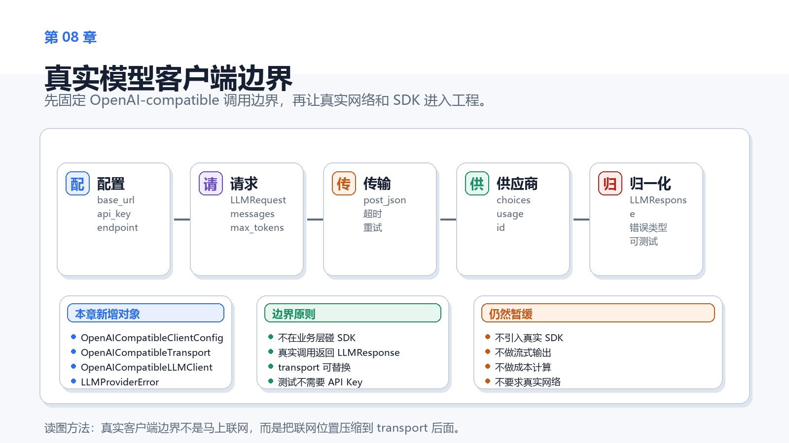
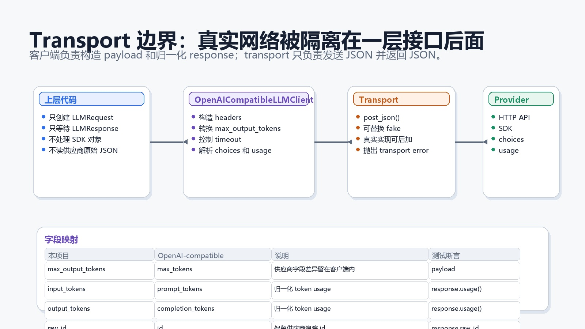
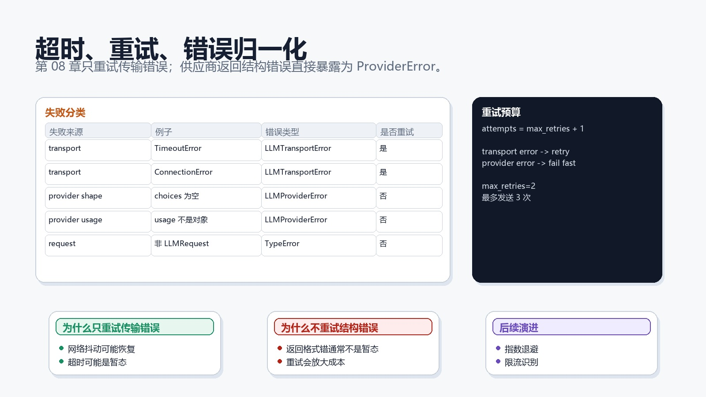
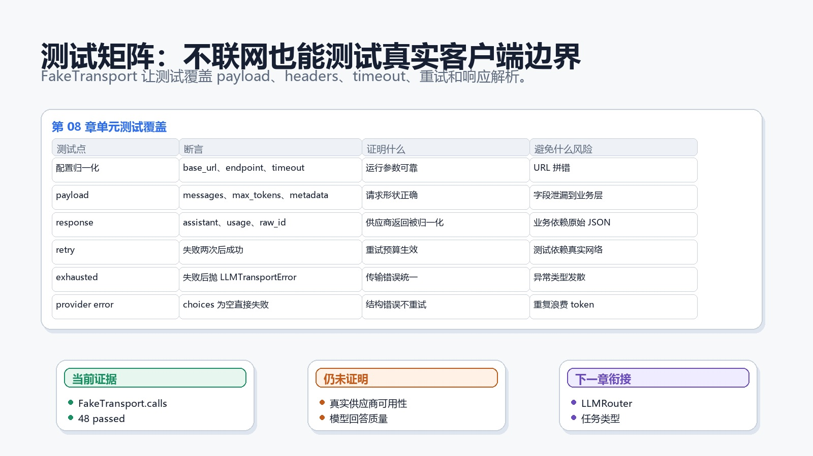

# 第 08 章：真实模型客户端边界



## 1. 本章交付物

第 07 章已经有了 `BaseLLMClient` 和 `MockLLMClient`。第 08 章进入真实模型客户端边界，但仍然不要求真实 API Key，也不访问真实网络。

本章新增：

```python
OpenAICompatibleClientConfig
OpenAICompatibleTransport
OpenAICompatibleLLMClient
LLMClientError
LLMTransportError
LLMProviderError
```

完成本章后，项目应该能做到：

- 用 OpenAI-compatible 形状构造请求。
- 把 `LLMRequest.max_output_tokens` 转成供应商常见的 `max_tokens`。
- 通过可注入 `transport` 隔离真实 HTTP 或 SDK。
- 统一处理 timeout、connection error 和 retry budget。
- 把供应商返回的 `choices`、`usage`、`id` 归一化为 `LLMResponse`。
- 用 fake transport 完成单元测试，不依赖真实 API Key。

## 1.1 完成态

完成本章时，你应该能解释这条链路：

```text
LLMRequest
  -> OpenAICompatibleLLMClient
  -> OpenAICompatibleTransport.post_json()
  -> provider-like JSON
  -> LLMResponse
```

如果只能说“接 OpenAI API”，但说不清配置、payload、transport、重试和响应归一化分别在哪一层，本章还没有完成。

## 2. 为什么本章不直接装 SDK

很多项目第一次接模型时，会直接在业务代码里写：

```python
client.chat.completions.create(...)
```

这样短期能跑，长期会把三个东西混在一起：

- 业务层想要什么回答。
- 供应商 SDK 要什么字段。
- 网络错误和供应商错误怎么处理。

第 08 章要做的是把边界先固定下来。真实 SDK 可以后续替换 `transport`，但业务层不应该直接依赖 SDK 的对象、异常和 JSON 结构。

## 3. Transport 边界



本章的关键设计是：

```python
class OpenAICompatibleTransport(ABC):
    async def post_json(
        self,
        url: str,
        headers: Mapping[str, str],
        payload: Mapping[str, Any],
        timeout_seconds: float,
    ) -> Mapping[str, Any]:
        ...
```

`OpenAICompatibleLLMClient` 不直接做 HTTP。它只依赖 `post_json()`。

这带来两个直接收益：

- 测试可以使用 fake transport，完全不联网。
- 将来可以用 `httpx`、官方 SDK 或内部网关实现 transport，而不改上层 Agent。

## 4. 配置对象

真实客户端需要这些运行配置：

```python
OpenAICompatibleClientConfig(
    base_url="https://api.example.test/v1",
    api_key="test-key",
    endpoint="/chat/completions",
    timeout_seconds=30.0,
    max_retries=0,
)
```

字段含义：

| 字段 | 作用 |
|------|------|
| `base_url` | 供应商或内部网关根地址 |
| `api_key` | 鉴权字符串，本章只进入 header，不落文档和测试真实值 |
| `endpoint` | OpenAI-compatible chat completions 路径 |
| `timeout_seconds` | 单次 transport 调用超时 |
| `max_retries` | transport 错误的额外重试次数 |

配置对象会归一化：

- `base_url` 去掉末尾 `/`。
- `endpoint` 自动补开头 `/`。
- `api_key` 去掉首尾空白。

它会拒绝：

- 空 `base_url`。
- 空 `api_key`。
- 空 `endpoint`。
- 小于等于 0 的 timeout。
- 负数 retry。

## 5. Payload 映射

本项目内部请求是：

```python
LLMRequest(
    model="gpt-compatible",
    messages=(...),
    temperature=0.2,
    max_output_tokens=64,
    metadata={"trace_id": "req-008"},
)
```

发给 OpenAI-compatible provider 时会变成：

```python
{
    "model": "gpt-compatible",
    "messages": [...],
    "temperature": 0.2,
    "max_tokens": 64,
    "metadata": {"trace_id": "req-008"},
}
```

注意字段差异：

| 内部字段 | 供应商字段 |
|----------|------------|
| `max_output_tokens` | `max_tokens` |
| `Message.to_dict()` | `messages[]` |
| `metadata` | `metadata` |

字段差异必须留在客户端边界内，不应该散落到 Agent 或工具层。

## 6. Header 构造

客户端会构造：

```python
headers = {
    "Authorization": f"Bearer {api_key}",
    "Content-Type": "application/json",
}
```

测试只使用 `test-key` 这类占位值。真实密钥只能来自环境变量或 GitHub Secrets，不能写进源码、文档或测试 fixture。

## 7. 响应归一化

供应商响应可能长这样：

```python
{
    "id": "chatcmpl-008",
    "model": "gpt-compatible",
    "choices": [
        {
            "message": {"role": "assistant", "content": "Normalized answer."},
            "finish_reason": "stop",
        }
    ],
    "usage": {"prompt_tokens": 11, "completion_tokens": 7},
}
```

项目内部只返回：

```python
LLMResponse(
    model="gpt-compatible",
    message=Message(role="assistant", content="Normalized answer."),
    input_tokens=11,
    output_tokens=7,
    finish_reason="stop",
    raw_id="chatcmpl-008",
)
```

这让后续 Agent、成本统计、日志和评估都只面对 `LLMResponse`，不用知道供应商原始 JSON。

## 8. 错误分类



本章新增三类客户端错误：

| 错误 | 用途 |
|------|------|
| `LLMClientError` | LLM 客户端错误基类 |
| `LLMTransportError` | 网络、超时、连接等传输错误 |
| `LLMProviderError` | 供应商返回结构错误或字段非法 |

当前策略很克制：

- `TimeoutError`、`ConnectionError`、`LLMTransportError` 可以重试。
- provider 返回结构缺失、usage 类型错误、负 token 不重试。
- 非 `LLMRequest` 输入直接 `TypeError`。

这样做的理由是：传输错误可能是暂态，结构错误通常不是暂态。盲目重试结构错误只会浪费成本。

## 9. Retry budget

`max_retries` 表示额外重试次数。

```text
max_retries = 0 -> 最多 1 次
max_retries = 1 -> 最多 2 次
max_retries = 2 -> 最多 3 次
```

本章不做指数退避、不做 jitter、不做限流识别。那些能力会在后续生产化章节再加。

当前目标只是让 retry budget 可配置、可测试、可解释。

## 10. FakeTransport 测试



测试文件：

```text
tests/unit/test_openai_compatible_client.py
```

它定义了一个 fake transport：

```python
@dataclass
class FakeTransport(OpenAICompatibleTransport):
    responses: list[Mapping[str, Any]]
    errors: list[Exception]
    calls: list[dict[str, Any]]
```

Fake transport 做两件事：

- 记录客户端传入的 url、headers、payload、timeout。
- 按顺序抛出错误或返回 provider-like JSON。

这样测试可以证明客户端边界，而不需要真实网络。

## 11. 测试覆盖

第 08 章测试覆盖：

- 配置归一化和非法配置。
- payload、headers 和 timeout 是否正确传给 transport。
- provider response 是否归一化为 `LLMResponse`。
- transport 错误是否按 retry budget 重试。
- retry budget 用完后是否抛出 `LLMTransportError`。
- provider response 结构错误是否抛出 `LLMProviderError` 且不重试。
- 非 `LLMRequest` 输入是否拒绝。

这些测试证明的是边界质量，不是模型质量。

## 12. 企业级取舍

### 12.1 为什么 client 不直接导入 HTTP 库

因为本课程还没有进入生产 HTTP 客户端选型。现在如果直接引入 `httpx` 或某个 SDK，学习重点会从边界设计变成库细节。

先定义 transport，可以让后续替换实现时不动测试主线。

### 12.2 为什么错误类型这么少

本章只区分 transport 和 provider。

生产系统可能还会区分：

- 鉴权失败。
- 限流。
- 内容安全拒绝。
- 服务端 5xx。
- 响应解析失败。

这些分类会在监控、熔断和安全章节逐步细化。

### 12.3 为什么不在这里读环境变量

第 04 章已经有配置加载示例。本章只定义客户端边界。

从环境变量读取 API Key 应该发生在应用装配层，而不是发生在 `OpenAICompatibleLLMClient.complete()` 里。

## 13. 常见问题

### 13.1 这个客户端现在能不能直接打真实 API

不能。它还需要一个真实 transport 实现。

这是有意的。本章先测试边界，下一步再决定使用官方 SDK、`httpx`，还是企业内部模型网关。

### 13.2 为什么叫 OpenAI-compatible，不叫 OpenAI

因为很多供应商和内部网关都兼容 OpenAI chat completions 的请求形状。

本章学习的是一种通用兼容边界，不把工程绑定到单一供应商。

### 13.3 为什么 provider 结构错误不重试

因为返回结构不符合预期时，重试通常不会改变结果。更好的做法是尽快失败，让测试或监控暴露问题。

## 14. 读者自测

不看正文，回答下面 6 个问题：

1. `OpenAICompatibleTransport` 为什么只暴露 `post_json()`？
2. `max_output_tokens` 为什么要在客户端里转成 `max_tokens`？
3. `LLMTransportError` 和 `LLMProviderError` 的边界是什么？
4. `max_retries=2` 最多会调用 transport 几次？
5. Fake transport 能证明什么，不能证明什么？
6. 为什么业务层不应该读取 provider 原始 JSON？

## 15. 练习

1. 新增一个测试：provider response 没有 `usage` 时 token 默认为 0。
2. 新增一个测试：provider response 的 `usage.prompt_tokens` 是字符串时抛出 `LLMProviderError`。
3. 修改 `endpoint="chat/completions"`，确认配置会自动补 `/`。
4. 写一个真实 transport 的伪代码，但不要把它接进单元测试。
5. 思考：限流错误应该算 transport error，还是 provider error？

## 16. 验收标准

验收命令：

```powershell
python -m pytest
```

第 08 章完成后应看到：

```text
48 passed
```

## 17. 下一章

第 09 章会进入多模型路由。

你会学习如何用 `task_type` 把同一个 `LLMRequest` 交给不同模型和客户端，并保持上层代码只依赖 `BaseLLMClient`。
