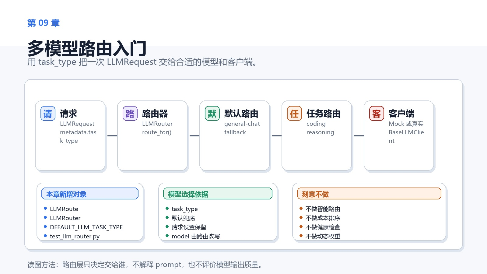
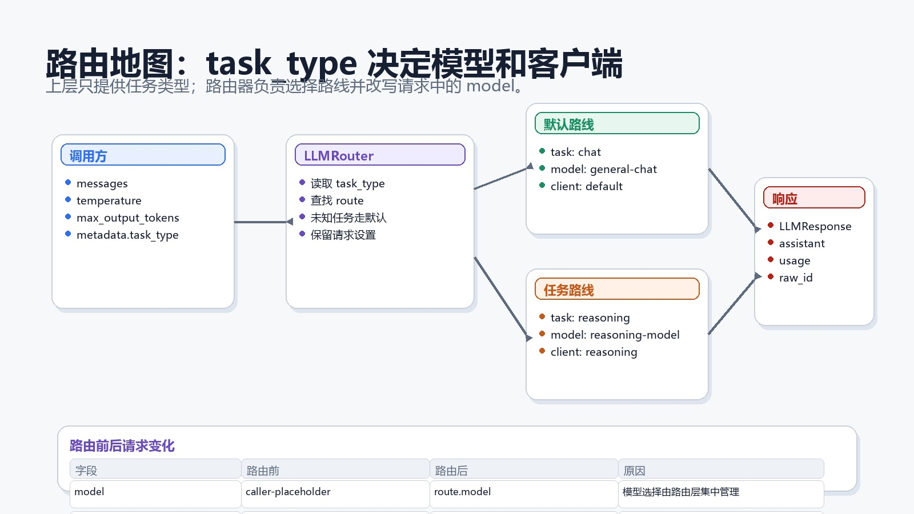
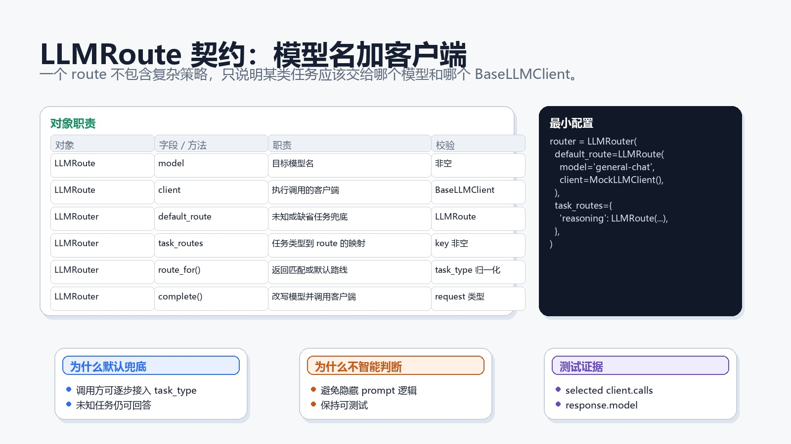
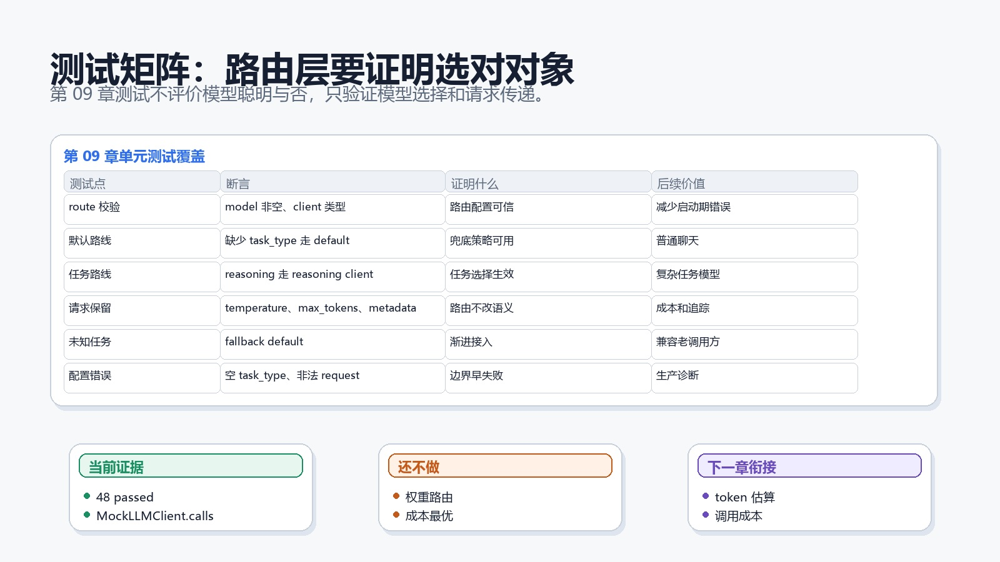

# 第 09 章：多模型路由入门



## 1. 本章交付物

第 08 章已经把真实客户端边界固定下来。第 09 章开始解决另一个问题：不同任务不一定应该使用同一个模型。

本章新增：

```python
DEFAULT_LLM_TASK_TYPE
LLMRoute
LLMRouter
```

完成本章后，项目应该能做到：

- 用 `task_type` 表达一次模型调用的任务类型。
- 用 `LLMRoute` 绑定目标模型和客户端。
- 用 `LLMRouter` 按任务类型选择 route。
- 缺少或未知任务类型时走默认 route。
- 路由时只改写 `model`，保留 messages、temperature、max_output_tokens 和 metadata。
- 用 Mock 客户端证明路由选择，不依赖真实 API。

## 1.1 完成态

完成本章时，你应该能解释这条链路：

```text
LLMRequest(metadata={"task_type": "reasoning"})
  -> LLMRouter
  -> LLMRoute(model="reasoning-model", client=reasoning_client)
  -> reasoning_client.complete(routed_request)
  -> LLMResponse
```

如果只能说“根据任务选模型”，但说不清任务类型在哪里、模型名在哪里被改写、请求设置如何保留，本章还没有完成。

## 2. 为什么需要路由层

真实企业 Agent 很少只用一个模型。

常见拆分是：

- 普通聊天用便宜、快速模型。
- 复杂推理用更强模型。
- 代码任务用代码模型。
- 摘要任务用长上下文模型。
- 内部数据任务用私有模型或本地模型。

如果每个调用方都自己判断模型，工程会很快失控：

- 模型名散落在业务代码里。
- 成本策略难以统一。
- 测试很难证明选了哪个模型。
- 替换供应商时影响面不清楚。

路由层的价值是把“任务到模型和客户端”的选择集中起来。

## 3. 路由地图



本章路由逻辑很小：

1. 从 `request.metadata["task_type"]` 读取任务类型。
2. 没有任务类型时使用 `DEFAULT_LLM_TASK_TYPE = "chat"`。
3. 查找 `task_routes`。
4. 找不到时使用 `default_route`。
5. 构造一个新的 `LLMRequest`，把 `model` 改成 route 的模型。
6. 调用 route 的 client。

注意：路由层不改用户消息，不改 temperature，不改 max_output_tokens，也不删除 metadata。

## 4. LLMRoute



`LLMRoute` 是一个很小的对象：

```python
@dataclass(frozen=True)
class LLMRoute:
    model: str
    client: BaseLLMClient
```

它只表达一件事：

```text
这个 route 使用哪个模型，由哪个 client 执行。
```

校验规则：

- `model` 不能为空。
- `client` 必须是 `BaseLLMClient`。

为什么 route 不直接放 `task_type`？

因为 task type 是映射的 key：

```python
task_routes={
    "reasoning": LLMRoute(model="reasoning-model", client=reasoning_client),
}
```

这样一个 route 可以复用到多个任务，也避免对象里重复存 key。

## 5. LLMRouter

`LLMRouter` 本身也是一个 `BaseLLMClient`：

```python
class LLMRouter(BaseLLMClient):
    async def complete(self, request: LLMRequest) -> LLMResponse:
        ...
```

这很重要。调用方可以只依赖：

```python
BaseLLMClient
```

它不知道自己拿到的是：

- `MockLLMClient`
- `OpenAICompatibleLLMClient`
- `LLMRouter`

这让上层 Agent 代码保持稳定。

## 6. 最小配置

一个最小路由器长这样：

```python
router = LLMRouter(
    default_route=LLMRoute(
        model="general-chat",
        client=MockLLMClient(response_text="default answer"),
    ),
    task_routes={
        "reasoning": LLMRoute(
            model="reasoning-model",
            client=MockLLMClient(response_text="reasoning answer"),
        ),
    },
)
```

当请求没有 `task_type`：

```python
LLMRequest(model="caller-placeholder", messages=(...))
```

它会走 `default_route`。

当请求带有：

```python
metadata={"task_type": "reasoning"}
```

它会走 `reasoning` route。

## 7. 为什么路由会改写 model

调用方传入的 request 里也有 `model` 字段。那为什么路由层还要改写？

因为第 09 章开始，模型选择应该集中在路由层。

调用方可以先放一个占位模型：

```python
model="caller-placeholder"
```

路由器根据任务类型选择真正模型：

```python
model="reasoning-model"
```

这样做有三个好处：

- 模型策略集中管理。
- 测试可以通过 downstream client 的 `calls` 验证模型是否被正确改写。
- 后续成本策略、限流和模型替换都可以集中在路由层附近演进。

## 8. 为什么保留请求设置

路由只决定“交给谁”，不应该改变“要问什么”。

所以路由后的请求会保留：

- `messages`
- `temperature`
- `max_output_tokens`
- `metadata`

只改：

- `model`

这是一个边界原则。路由层不是 prompt 改写层，也不是策略生成层。

## 9. 默认 route

未知任务类型会走默认 route。

例如：

```python
metadata={"task_type": "summarization"}
```

如果没有配置 `summarization`，就走默认模型。

这是一种保守选择。它让旧调用方或新任务类型可以先跑起来，而不是一接入就失败。

生产系统可以把这个策略改成更严格的模式，例如未知任务直接拒绝。但本章选择默认兜底，方便学习者理解路由主线。

## 10. 测试矩阵



测试文件：

```text
tests/unit/test_llm_router.py
```

它覆盖：

- `LLMRoute` 校验模型名和客户端类型。
- `LLMRouter` 实现 `BaseLLMClient`。
- 缺少 `task_type` 时走默认 route。
- 指定 `reasoning` 时走 reasoning route。
- 路由后的请求保留 temperature、max_output_tokens 和 metadata。
- 未知 task type 走默认 route。
- `route_for()` 会归一化大小写和空白。
- 非法配置和非法 request 会早失败。

## 11. 用 Mock 验证路由

第 09 章仍然不需要真实模型。

Mock 客户端已经有 `calls`：

```python
assert reasoning_client.calls[0].model == "reasoning-model"
```

这条断言很关键。它证明：

- 路由器真的选了 reasoning client。
- 路由器真的把 request.model 改成了 route.model。
- 原请求设置没有被丢掉。

如果没有第 07 章的 Mock 调用历史，第 09 章很难稳定验证路由行为。

## 12. 企业级取舍

### 12.1 为什么不用智能路由

可以让模型自己判断任务类型，也可以用分类器判断。

本章不做。

原因是第 09 章只引入任务路由的工程边界。智能分类会引入另一个模型调用，增加成本、延迟和测试复杂度。

先用显式 `task_type`，路由结果最可解释。

### 12.2 为什么 unknown fallback 而不是报错

两种策略都合理。

本章选择 fallback，是因为课程还处在基础阶段，默认模型可以作为渐进接入的兜底。

如果进入生产系统，可以按风险调整：

- 低风险任务 unknown fallback。
- 高风险任务 unknown reject。
- 内部数据任务 unknown require approval。

### 12.3 为什么 route 里同时有 model 和 client

有些项目只路由模型名，然后用同一个客户端调用。

企业系统里不同模型可能来自不同供应商、不同网关、不同鉴权方式。把 `client` 放进 route，可以让一个路由器同时管理 Mock、OpenAI-compatible、本地模型和内部网关。

## 13. 常见问题

### 13.1 task_type 放在 metadata 里会不会太随意

当前阶段是够用的。

第 06 章已经给 `LLMRequest` 留了 metadata。第 09 章先复用它，避免为了一个字段过早扩大请求对象。

如果后续 task type 成为强约束，可以把它提升为 `LLMRequest` 的正式字段。

### 13.2 路由器会不会隐藏模型选择

不会。相反，它让模型选择更集中。

调用方不再散落模型名，测试也能直接断言 selected client 的 `calls`。

### 13.3 能不能按成本自动选模型

可以，但不是本章。

第 10 章会进入 token 和成本统计。只有先有成本数据，路由层才有依据做成本策略。

## 14. 读者自测

不看正文，回答下面 6 个问题：

1. `LLMRoute` 为什么需要同时保存 model 和 client？
2. `LLMRouter` 为什么也继承 `BaseLLMClient`？
3. `task_type` 缺失时会发生什么？
4. 路由后的 request 哪些字段会保留，哪个字段会改写？
5. 为什么第 09 章不做智能路由？
6. Mock 客户端的 `calls` 如何证明路由选对了？

## 15. 练习

1. 新增一个 `coding` route，并写测试证明 coding 请求会走 coding client。
2. 新增一个测试：`task_type=" REASONING "` 也能命中 `reasoning` route。
3. 新增一个测试：未知任务走默认 route，但 metadata 中原始 task_type 仍被保留。
4. 思考：高风险任务 unknown 时应该 fallback 还是 reject？
5. 思考：如果 route 的 client 抛出 `LLMTransportError`，router 是否应该捕获？

## 16. 验收标准

验收命令：

```powershell
python -m pytest
```

第 09 章完成后应看到：

```text
48 passed
```

## 17. 下一章

第 10 章会进入 Token 与成本统计。

你会学习如何估算 token、记录调用成本、设置预算限制，并让路由层未来有成本依据。
