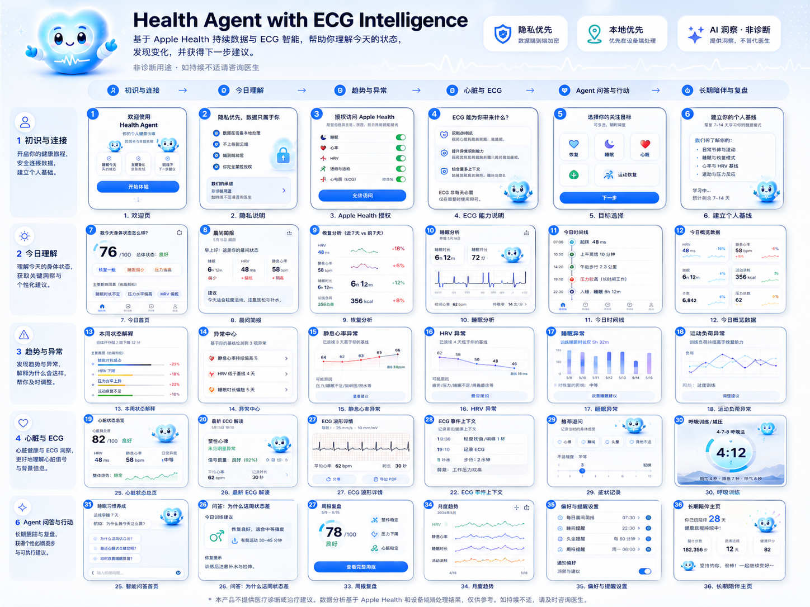
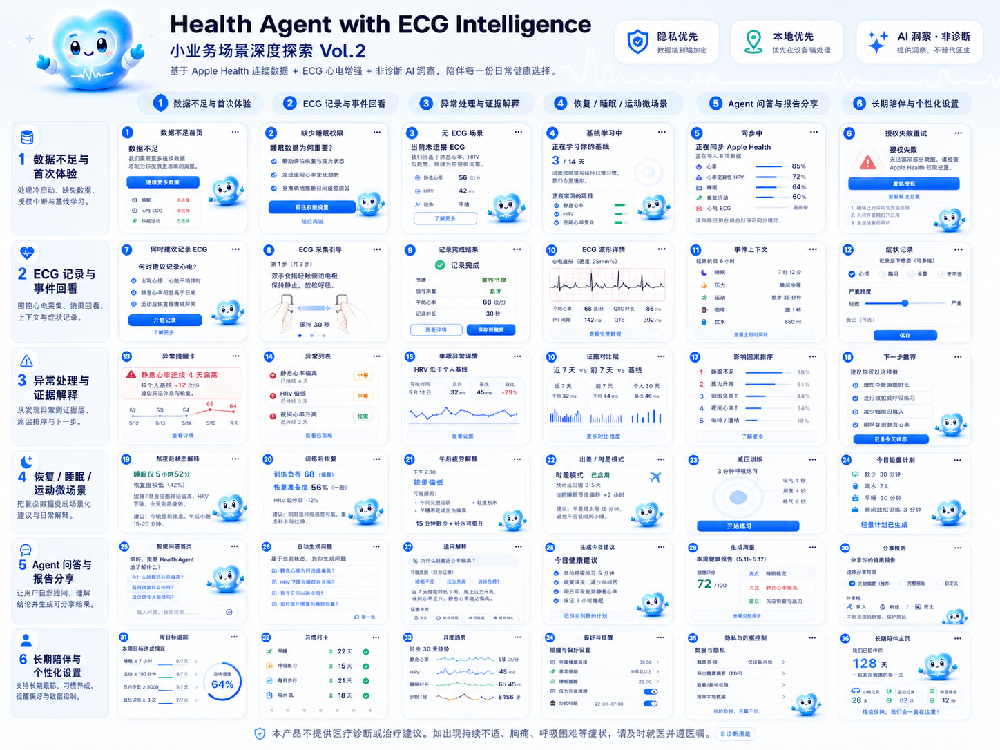
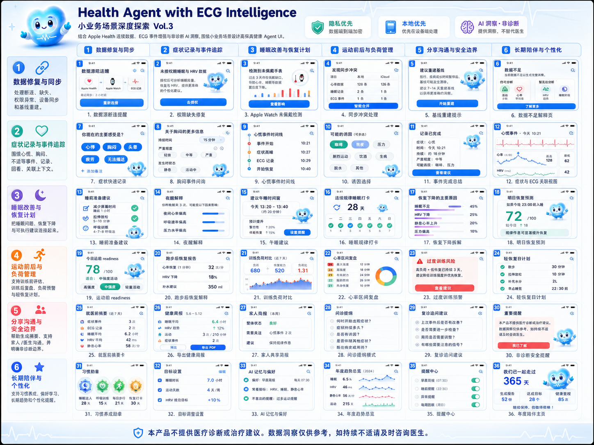

三版小业务场景图    
    
    
    


下面是一份可给产品、设计、研发直接对齐的**落地型 UI/UX 优化文档**。我会基于你给出的三版全生命周期探索稿，把它重新收敛成一套更适合大众 C 端健康产品的设计方向，重点围绕：**视觉、易用性、智能化、云 Agent 分身、越用越懂用户、分身记忆前端具象化**。

---

# Health Agent with ECG Intelligence

## C 端健康 Agent 产品 UI/UX 优化方向文档

## 0. 总体评价

这三版探索已经把产品的业务边界打开得很充分：

第一版更像完整产品蓝图，覆盖从初识连接、今日理解、趋势异常、心脏 ECG、Agent 问答到长期陪伴。

第二版开始深入小业务场景，例如数据不足、ECG 事件回看、异常处理、恢复/睡眠/运动干预、报告分享和个性化设置。

第三版进一步接近真实用户路径，把数据修复、症状记录、睡眠计划、运动前后负荷、家庭分享、年度总结等细节补齐。

当前最大的问题不是“功能不够”，而是：**功能太多、表达太满、智能感还停留在卡片展示，没有形成一个越用越懂用户的 Agent 心智。**

下一阶段设计目标应该从“健康功能合集”升级为：

> **一个有记忆、有判断、有边界、有陪伴感的个人健康云分身。**

---

# 1. 产品体验总方向

## 1.1 从 Dashboard 转向 Agent OS

当前 UI 大量使用卡片、分数、趋势图、异常列表，本质还是健康 Dashboard。
但用户真正需要的是：

“今天我该注意什么？”
“为什么会这样？”
“我现在应该做什么？”
“这个现象和过去有关吗？”
“你是不是越来越了解我？”

所以产品应从“展示数据”转为“解释数据 + 形成建议 + 记住反馈 + 下一次更准”。

建议产品核心心智定义为：

> **你的健康云分身，每天读懂 Apple Health、ECG、睡眠、心率、活动和你的主观反馈，帮你发现变化、解释原因、给出行动建议，并持续形成个人健康记忆。**

---

# 2. 用户全生命周期重构

建议把完整生命周期收敛为 6 个阶段，每个阶段只聚焦一个核心小业务目标。

| 生命周期阶段   | 用户心理             | 当前稿件覆盖                  | 优化后的核心任务          | 关键页面           |
| -------- | ---------------- | ----------------------- | ----------------- | -------------- |
| 1. 初识与连接 | 这个产品可信吗？会不会泄露隐私？ | 授权、隐私说明、Apple Health 连接 | 建立信任 + 快速接入数据     | 欢迎页、权限页、数据源页   |
| 2. 首日理解  | 它能不能马上看懂我？       | 今日首页、健康问卷、恢复分数          | 给出第一份“今日身体解释”     | 今日状态页          |
| 3. 日常洞察  | 今天有什么变化？         | Agent 发现、趋势异常、今日时间线     | 每天 1-3 条高价值发现     | 今日洞察流          |
| 4. 异常与事件 | 我是不是有问题？严重吗？     | HRV 异常、心率异常、ECG 解读      | 风险分级 + 证据解释 + 下一步 | 异常详情页、ECG 详情页  |
| 5. 行为干预  | 我现在该怎么做？         | 睡眠建议、训练恢复、呼吸练习          | 生成可执行小计划          | 今日行动计划         |
| 6. 长期陪伴  | 它是否越来越懂我？        | 长期陪伴主页、习惯、年度总结          | 云 Agent 分身记忆与成长   | 分身主页、记忆中心、健康画像 |

核心原则：
**每个阶段只解决一个主问题，不要让每个页面都同时承担展示、解释、提醒、设置、报告、社交、陪伴。**

---

# 3. 信息架构优化

## 3.1 当前问题

目前三个版本里，功能很多，但入口关系不够清晰：

“首页、发现、趋势、ECG、Agent、设置、长期陪伴、报告、记录、问诊、分享”之间容易互相重叠。
用户会感觉每个页面都像一个小功能，而不是一个连续体验。

## 3.2 建议底部导航

建议 C 端主导航控制在 5 个以内：

| Tab | 定位            | 主要承载                |
| --- | ------------- | ------------------- |
| 今日  | 每天打开 App 的主入口 | 今日状态、恢复分数、关键提醒、行动建议 |
| 洞察  | Agent 发现流     | 异常、趋势、解释、证据卡        |
| 记录  | ECG / 症状 / 事件 | ECG 记录、症状记录、事件时间线   |
| 分身  | 云 Agent 人格化入口 | 对话、记忆、健康画像、陪伴成长     |
| 我的  | 数据源与设置        | 权限、隐私、目标、报告、家庭共享    |

不建议把“Agent”只做成底部中间的吉祥物图标。
它应该是一个明确功能区：**分身**。

---

# 4. 视觉设计优化方向

## 4.1 当前视觉优点

现有视觉有几个明显优点：

品牌主色统一。
卡片圆角亲和。
Agent 形象有记忆点。
整体气质轻松，适合大众用户。
蓝色医疗科技感与健康场景相符。

## 4.2 当前视觉问题

主要问题有四个：

### 问题一：过度蓝色化

大量浅蓝背景、蓝色描边、蓝色按钮、蓝色图标叠加后，页面缺少主次。
用户很难判断哪个信息最重要。

### 问题二：所有卡片都像重点

每个模块都有边框、阴影、图标、数字、状态标签，导致视觉噪音较高。

### 问题三：卡通感与健康专业性冲突

Agent 很可爱，但 ECG、异常、心律、风险提示是严肃场景。
如果所有页面都出现萌系形象，会削弱专业可信度。

### 问题四：图表装饰感强于解释感

很多小折线图、环形图、柱状图看起来丰富，但没有清楚回答“为什么”和“怎么办”。

---

# 5. 视觉系统落地建议

## 5.1 色彩系统

建议建立 5 类颜色，而不是全局都用蓝色。

| 颜色类型 | 用途         | 建议        |
| ---- | ---------- | --------- |
| 品牌蓝  | 主按钮、链接、选中态 | 控制使用面积    |
| 健康绿  | 正常、良好、达标   | 只用于正向状态   |
| 注意黄  | 轻微异常、建议关注  | 用于中等级提醒   |
| 风险红  | 明显异常、需处理   | 严格限制，避免滥用 |
| 中性灰蓝 | 背景、卡片、辅助文字 | 增强高级感     |

建议状态色规则：

正常：绿色
波动：蓝色或灰蓝
建议关注：黄色
明显异常：红色
无法判断：灰色

不要让“心率偏高”“HRV 下降”“记录状态中等”“信号良好”等多个状态同时抢色。

---

## 5.2 字体层级

建议建立固定字号体系：

| 层级         | 用途       | 建议               |
| ---------- | -------- | ---------------- |
| H1         | 页面标题     | 26-30px，Semibold |
| H2         | 卡片标题     | 18-22px，Semibold |
| Body       | 解释文字     | 14-16px          |
| Caption    | 单位、来源、备注 | 12-13px          |
| Big Number | 核心健康数字   | 40-56px          |

当前标题字重偏重，适合海报，不适合长期使用的健康 App。
建议减少超粗字体，让界面更耐看、更可信。

---

## 5.3 卡片系统

建议卡片分为 4 种，不要所有卡片一个样式。

| 卡片类型 | 用途          | 视觉            |
| ---- | ----------- | ------------- |
| 主结论卡 | 今日状态、恢复分数   | 大面积、强层级、少信息   |
| 证据卡  | 解释原因        | 中等层级，带数据来源    |
| 行动卡  | 建议用户做什么     | 明确按钮          |
| 记忆卡  | Agent 记住了什么 | 轻拟物、带时间和可编辑入口 |

尤其首页不要堆 8-10 张卡。
首页推荐结构：

1 个主结论卡
3 个原因卡
1 个行动计划卡
1 个 Agent 记忆提示

---

# 6. 首页优化方案

## 6.1 当前首页问题

当前首页有恢复分数、睡眠、HRV、静息心率、活动负荷、快捷问题等信息。
但用户打开后最想知道的是：

“我今天到底怎么样？”
“为什么？”
“要不要做点什么？”

现在答案不够集中。

## 6.2 建议首页结构

首页应采用“结论先行”。

### 第一屏结构

顶部：

“早上好，Alex”
“今天恢复偏低，建议轻量活动”

主卡：

恢复状态：72/100
状态：建议关注
较昨日：+12
主要原因：睡眠不足、HRV 低于基线、夜间心率偏高

行动按钮：

查看原因
生成今日计划

次级卡：

睡眠：6h08m，低于目标 52m
HRV：42ms，低于个人基线 18%
静息心率：58bpm，高于基线 6bpm

Agent 记忆提示：

“我记得你连续 3 次在睡眠不足后，上午专注力会下降。今天建议把高强度任务放到下午。”

这句话非常关键，它会让用户第一次感受到“它懂我”。

---

# 7. Agent 发现页优化

## 7.1 当前问题

现在 Agent 发现页像“智能通知列表”。
它告诉用户“恢复下降、夜间心率偏高、睡眠不足、有 ECG 可分析”，但缺少行动闭环。

## 7.2 建议改成“洞察流”

每条洞察必须包含 4 层：

1. 发现了什么
2. 为什么这么判断
3. 对你意味着什么
4. 下一步做什么

示例：

**恢复下降**
今天恢复分数较 7 日均值低 14 分。
主要关联：睡眠时长低于目标 52 分钟，HRV 低于个人基线 18%。
可能影响：上午注意力和运动恢复。
建议：今天避免高强度训练，安排 20 分钟轻量活动。

按钮：

查看证据
生成今日计划
不适合我

“不是我”这个反馈入口非常重要。
它是 Agent 越用越懂用户的前端入口。

---

# 8. ECG 页面优化

## 8.1 当前问题

ECG 页面视觉完整，但仍有几个专业风险：

波形区域偏小。
结论过于直接。
记录前/中/后的上下文很好，但没有形成解释链。
“非诊断”信息应该更稳定、更清晰。
异常时缺少风险分级和行动建议。

## 8.2 ECG 页面建议结构

### 页面顶部

标题：本次 ECG 解读
副标题：记录于 2025/05/15 08:23，时长 30 秒

### 第一层：结论卡

“本次记录显示：未见明显异常提示”
或
“本次记录存在需要关注的节律波动”

状态分级：

正常
可观察
建议关注
建议咨询医生

注意：尽量避免直接使用“诊断式语言”。
比如“窦性心律”可以保留，但建议呈现为：

“本次记录呈现窦性心律特征，仅供健康参考。”

### 第二层：波形卡

放大 ECG 波形区域。
支持横向滑动、缩放、R 峰标记、异常段标记。
显示信号质量、采样速度、记录姿态。

### 第三层：上下文解释

把记录前/中/后变成解释链：

记录前：压力中等、咖啡 1 杯
记录中：静息、状态平稳
记录后：情绪平稳
Agent 判断：本次记录可信度较高，暂未发现明显干扰因素

### 第四层：行动建议

正常：保存记录、加入长期趋势
可观察：建议未来 3 天重复记录
建议关注：如伴随胸闷、心悸、呼吸困难，请及时就医
异常：提供导出 PDF、联系医生、家庭共享入口

---

# 9. 数据不足与授权失败场景优化

三版里“数据不足”是非常重要的小业务点，建议升级为完整体验。

## 9.1 当前价值

这是新用户最容易流失的地方。
如果没有 Apple Health 数据、没有 ECG、没有睡眠权限，首页会显得空。

## 9.2 优化方向

不要只说“数据不足”，要告诉用户：

缺了什么
为什么重要
怎么补齐
补齐后能得到什么

示例：

**还差 2 项数据，我就能更准确理解你**
已连接：心率、步数
未连接：睡眠、HRV
连接后可获得：恢复分析、睡眠建议、异常趋势提醒

按钮：

去授权
稍后再说
查看我现在能分析什么

这样即使数据不足，也能保持产品价值。

---

# 10. 云 Agent 分身设计

这是下一版最应该强化的核心差异化。

## 10.1 当前问题

现在 Agent 形象可爱，但更像吉祥物，不像“云分身”。
用户不会自然理解它具备：

记忆
学习
偏好
长期画像
主动关怀
跨场景推理

## 10.2 云 Agent 分身的产品定义

建议将 Agent 定义为：

> **你的健康云分身：它会读取你的健康数据、记录你的反馈、学习你的生活节律，并在每天关键时刻给出个性化提醒。**

它不是医生。
它不是单纯聊天机器人。
它是“个人健康理解层”。

---

# 11. 分身记忆的前端具象化

这是最关键的一部分。

用户必须“看见”Agent 正在记住自己，否则所谓智能化只是文案。

建议设计 5 个前端模块。

---

## 11.1 记忆卡片

在首页或分身页出现轻量提示：

**我记住了**
你通常在睡眠少于 6.5 小时时，第二天 HRV 会下降。
已基于最近 21 天数据学习。

操作：

有帮助
不准确
编辑记忆

这类卡片能让用户明确感知：“它越来越懂我”。

---

## 11.2 健康画像

分身页核心模块。

建议分为：

身体节律
睡眠偏好
恢复模式
运动耐受
压力反应
心率特征
ECG 记录习惯

示例：

**你的恢复模式**
连续两晚睡眠不足后，恢复分通常下降 12-18 分。
午后轻量活动对你的恢复有正向影响。
高强度训练后，你通常需要 36-48 小时恢复。

每一条画像都要有：

来源数据
更新时间
可信度
是否允许记住

---

## 11.3 记忆时间线

用时间线展示 Agent 学到的东西：

5 月 12 日：发现你晚睡后 HRV 通常下降
5 月 18 日：记住你偏好早上查看健康摘要
5 月 23 日：发现高压力工作日你的静息心率会上升
6 月 02 日：根据你的反馈，减少夜间心率提醒频率

这会让“云分身成长”变得可见。

---

## 11.4 记忆设置中心

用户必须能控制记忆，否则健康产品会让人不安。

建议设置分为：

允许记住的数据
允许记住的偏好
不再使用的记忆
导出我的健康画像
删除全部分身记忆

每条记忆都要支持：

查看
编辑
停用
删除

这会显著提升隐私信任。

---

## 11.5 分身等级与成长

可以保留轻量游戏化，但不要过度娱乐化。

示例：

**分身理解度：64%**
已了解：睡眠节律、HRV 基线、运动习惯
待完善：压力触发因素、ECG 事件上下文

下一步：

连续记录 7 天睡眠
完成 3 次症状反馈
授权 HRV 数据
补充运动目标

这样既有成长感，又服务真实业务。

---

# 12. 智能化能力前端表达

不要只写“AI 洞察”。
要把 AI 的能力拆成用户能理解的界面语言。

## 12.1 智能能力分层

| 能力   | 前端表达                       |
| ---- | -------------------------- |
| 读数据  | “我已读取过去 7 天睡眠、HRV、心率和活动数据” |
| 找变化  | “发现你的 HRV 连续 3 天下滑”        |
| 解释原因 | “主要关联睡眠不足和夜间心率升高”          |
| 给建议  | “今天建议轻量活动，不建议高强度训练”        |
| 记住反馈 | “已记住：你更喜欢晚上收到睡眠建议”         |
| 持续学习 | “我会观察接下来 7 天是否重复出现”        |

## 12.2 每个 AI 结论都要有“依据入口”

任何智能结论旁边都建议有一个小入口：

“为什么这么说？”

点击后展开：

使用数据：睡眠、HRV、静息心率
对比范围：最近 7 天 vs 个人基线
置信度：中高
限制：本结果不构成医疗诊断

---

# 13. 关键页面改造建议

## 13.1 今日页

目标：用户 10 秒内知道今天身体状态。

必须包含：

今日结论
恢复分数
主要原因
今日行动
Agent 记忆提示

不建议包含太多图表。
首页图表越多，理解越慢。

---

## 13.2 洞察页

目标：展示 Agent 发现的健康变化。

建议结构：

优先处理
持续观察
已改善
历史洞察

每条洞察必须可反馈：

有帮助
不准确
不再提醒
查看依据

反馈会进入分身记忆。

---

## 13.3 记录页

目标：让 ECG、症状、事件形成同一条健康证据链。

建议结构：

ECG 记录
症状记录
事件时间线
上下文标签
报告导出

重点不是单次 ECG，而是：

“这个 ECG 发生在什么情境里？”
“和睡眠、压力、咖啡、运动有没有关系？”

---

## 13.4 分身页

目标：让用户看见“它越来越懂我”。

建议结构：

分身状态
理解度
最近学到的 3 件事
健康画像
记忆时间线
偏好设置
对话入口

这里是最能建立长期留存的页面。

---

## 13.5 我的页

目标：权限、隐私、目标、报告、家庭共享。

不要把智能能力设置散落在其他页面。
所有数据控制和隐私解释都应该集中在这里。

---

# 14. 易用性优化

## 14.1 单页只保留一个主行动

当前页面按钮偏多，例如“查看详情、保存、导出、继续、下一步、记录、问答”等。
建议每页只突出一个主按钮。

示例：

ECG 正常页主按钮：保存到趋势
ECG 异常页主按钮：导出报告
睡眠不足页主按钮：生成今晚计划
运动恢复页主按钮：查看今日运动建议

---

## 14.2 用渐进披露减少压力

健康信息天然容易造成焦虑。
不要一上来展示太多异常指标。

推荐结构：

先给结论
再给原因
再给证据
最后给详细图表

大众 C 端用户不是医生，第一屏不要像医学报告。

---

## 14.3 异常页要有情绪安抚

比如：

“这并不一定代表严重问题，但值得继续观察。”
“如果你同时出现胸闷、胸痛、呼吸困难等症状，请及时就医。”
“我会帮你记录接下来 3 天的变化。”

这类文案能降低焦虑，同时提升专业感。

---

# 15. 研发落地组件清单

建议前端组件体系如下。

## 15.1 基础组件

HealthCard
MetricTile
StatusBadge
TrendSparkline
PrimaryActionButton
EvidenceDrawer
RiskLevelBar
AgentBubble
MemoryCard
TimelineEvent
ECGWaveformViewer
PermissionRepairCard
InsightFeedbackBar

---

## 15.2 业务组件

TodaySummaryCard
RecoveryScoreCard
InsightReasonCard
ActionPlanCard
ECGInterpretationCard
SymptomRecordCard
HealthTimeline
AgentMemoryFeed
HealthProfileCard
TwinGrowthCard
PrivacyControlCard

---

## 15.3 状态组件

DataMissingState
PermissionDeniedState
SyncingState
LowConfidenceState
NoAbnormalityState
NeedAttentionState
EmergencyGuidanceState
LearningInProgressState

这些状态需要提前定义，否则研发落地时会出现大量临时 UI。

---

# 16. Agent 记忆的数据结构建议

前端至少需要支持以下字段：

```json
{
  "memory_id": "m_001",
  "type": "sleep_recovery_pattern",
  "title": "睡眠不足会影响你的恢复",
  "description": "当你睡眠少于 6.5 小时时，第二天 HRV 通常下降 12%-18%。",
  "source": ["sleep", "hrv", "resting_heart_rate"],
  "confidence": 0.78,
  "created_at": "2025-05-15",
  "updated_at": "2025-05-28",
  "user_feedback": "helpful",
  "visibility": "visible",
  "editable": true
}
```

前端展示时不要直接显示复杂 JSON，而是转成用户语言：

“我发现……”
“基于……”
“可信度……”
“你可以修改或删除这条记忆。”

---

# 17. Agent 反馈闭环

每个洞察、建议、提醒都应该有轻量反馈。

建议统一三种反馈：

有帮助
不准确
不想再看到

反馈后的前端反馈：

“已记住，下次我会减少类似提醒。”
“我会重新观察这个模式。”
“已将这类提醒降级。”

这一步是“越用越懂我”的关键。

没有反馈闭环，Agent 就只是展示系统。

---

# 18. 长期陪伴设计

长期陪伴不能只是“连续使用多少天”。
它应该表达用户与分身共同成长。

建议长期陪伴页包含：

你已陪伴我 128 天
我理解了你的 7 个健康模式
本月你改善了 3 个习惯
还有 2 个模式需要更多数据确认
下个月建议关注睡眠稳定性和压力恢复

视觉上可以做成：

分身成长环
健康记忆星图
月度身体地图
年度健康故事
习惯徽章

但要注意：健康产品的游戏化要克制，不能像打卡软件过度刺激。

---

# 19. 报告与分享优化

目前报告分享方向是对的，但应区分三类报告：

| 报告类型 | 面向对象  | 内容             |
| ---- | ----- | -------------- |
| 日常摘要 | 用户自己  | 今日状态、原因、建议     |
| 事件报告 | 医生/家人 | ECG、症状、上下文、时间线 |
| 长期报告 | 用户/医生 | 月度趋势、异常频率、恢复模式 |

报告导出要避免夸大诊断能力。
建议在报告顶部固定显示：

“本报告基于 Apple Health、ECG 记录及用户输入生成，仅供健康参考，不构成医疗诊断。”

---

# 20. 视觉风格最终建议

整体风格建议从：

**可爱科技蓝**

升级为：

**温暖、可信、聪明、轻医疗感的个人健康助理**

关键词：

清爽
柔和
可信
有温度
不焦虑
有解释力
可控隐私
智能但不神秘

Agent 形象保留，但使用规则要明确：

首页：轻量陪伴
洞察页：解释辅助
异常页：降低存在感，专业优先
分身页：重点出现
隐私页：强调可控与安全
ECG 页：不喧宾夺主

---

# 21. 优先级建议

## P0：必须先做

信息架构重构
首页结论先行
异常风险分级
ECG 解释链
数据不足修复流程
Agent 反馈入口
分身记忆卡片
隐私与非诊断说明

## P1：增强体验

健康画像
记忆时间线
今日行动计划
洞察依据抽屉
报告导出
长期陪伴主页
权限修复中心

## P2：锦上添花

年度健康故事
分身等级
家庭共享
习惯徽章
更多动效
多 Agent 语气选择

---

# 22. 最终设计结论

这套 UI 的下一步不应该继续横向扩更多小页面，而应该纵向打磨 5 个核心闭环：

**连接数据 → 理解今天 → 发现异常 → 给出行动 → 形成记忆。**

视觉上要从“可爱健康看板”变成“可信赖的个人健康 Agent”。
易用性上要从“很多功能入口”变成“每天一个明确答案”。
智能化上要从“AI 生成洞察”变成“AI 解释依据、接受反馈、形成记忆”。
云 Agent 分身上要从“吉祥物”变成“可见、可控、可成长的个人健康记忆体”。

最重要的一句话：

> **用户不是为了看更多健康数据而来，而是为了被更好地理解、被及时提醒、被温和陪伴，并在关键时刻知道自己该怎么做。**
